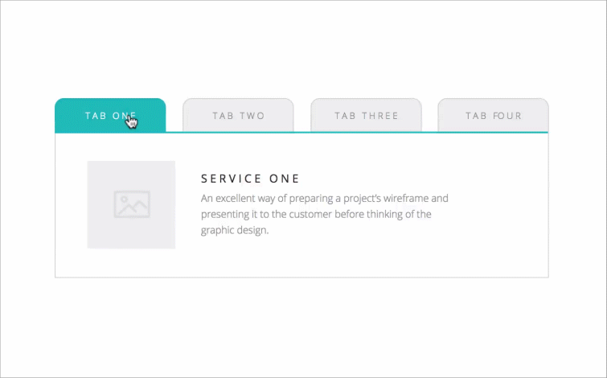

# Title: Interactive page challenge

- Repository: `interactive-page-challenge`
- Type of Challenge: `Consolidation Challenge`
- Duration: `8 hours`
- Deployment strategy : GitHub Pages
	
- Team challenge : `1 experienced junior` with `1 beginner junior` 

## Learning objectives
- Work together with a frontend designer and a frontend programmer
- Collaborate together on a single Git repository

### For experienced juniors (js):
- To be able to add interactivity with JS without altering HTML code or use JS to add to the document
- To be able to interact with designers / template designers
- To be able to make reusable widgets

### For beginners (html/css):
- To be able to coordinate your HTML with programmers
- To know the value of ids and classes as hooks
- To be able to visually separate blocks

### Both:
- To be able to use [data attributes](https://developer.mozilla.org/en-US/docs/Learn/HTML/Howto/Use_data_attributes) to add interactivity in HTML

## The Mission
We need a one-page website that promotes a local event.  
You can freely choose the theme of the event (party, sports, boardgames, becodeLanParty, ...).

Make a layout where users have the following parts:

- A photo slider at the top, with a left and right arrow people can use to control the slider
- A container with 3 tabs (summary, practical info, contact form)
- A section with some numbers about the event, they should start counting from 1, until a final value has been reached (eg: number of expected visitors)

For this mission you will be paired with an experienced junior that will write all javascript, and a beginner that will make the html and css.

The experienced junior is NOT allowed to touch HTML/CSS. 
You can use Bootstrap or any other framework but you cannot reuse existing Javascript-components, you have to write them from scratch!

Of course you can communicate the structure of the code to make the page interactive.
The communication is not optional to finish this challenge!

## Required features
### HTML/CSS
- Create a page with a big photo on top, and arrows to the left and right.
You can use images or ASCII characters.
- Create a container that has 3 tabs/buttons, all of them visible (hide them with JS).
    - Summary (text)
    - Practical info (address, email, date, ...) 
    - Contact form (Have an input field for name, email, message)
  For an idea how it could look like:
  
- At the bottom provide a section with some big numbers about the event.
- Make the code pass the W3C validator
- Do the lighthouse test and get a value of at least 70 for SEO and accessibility

### JS - Required
**You cannot use bootstrap components for this!**
- Make the numbers in the bottom interactive, on page load they should start at 1 and then count upwards until they reach the value in the HTML document.
Find a speed that makes it visually appealing.
- Disable the send button on the contact form, unless all fields have been filled in . 

### JS - Nice to have
- Make a photo slider that manages ANY number of photos, it changes pictures every 3 seconds, but you can also navigate with arrows. 
At the end of the last picture, start again.
- Make a tab system that hides all tabs expect the first one, then when a user clicks a button on top, make that part visible, hide the other tabcontent.

## Nice to have features
- Make the photo slider work for Mobiles with [touch](https://developer.mozilla.org/en-US/docs/Web/API/Touch_events)
- Add a google maps to the practical info
- Have the form mail the content to a specific email (you don't need code for this!)
